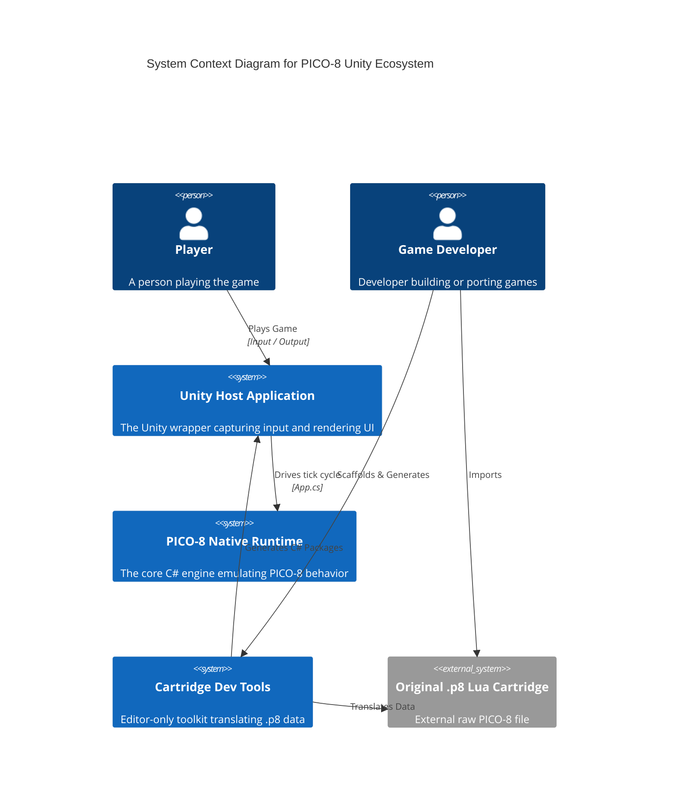
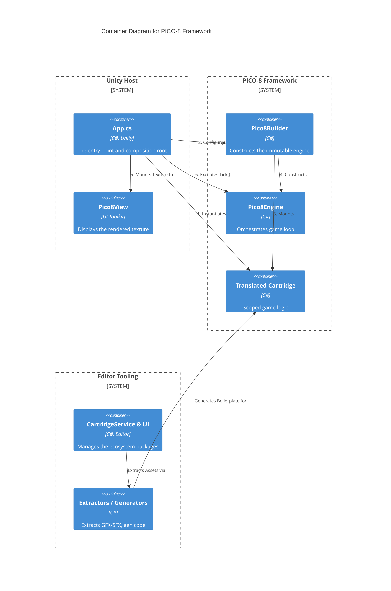
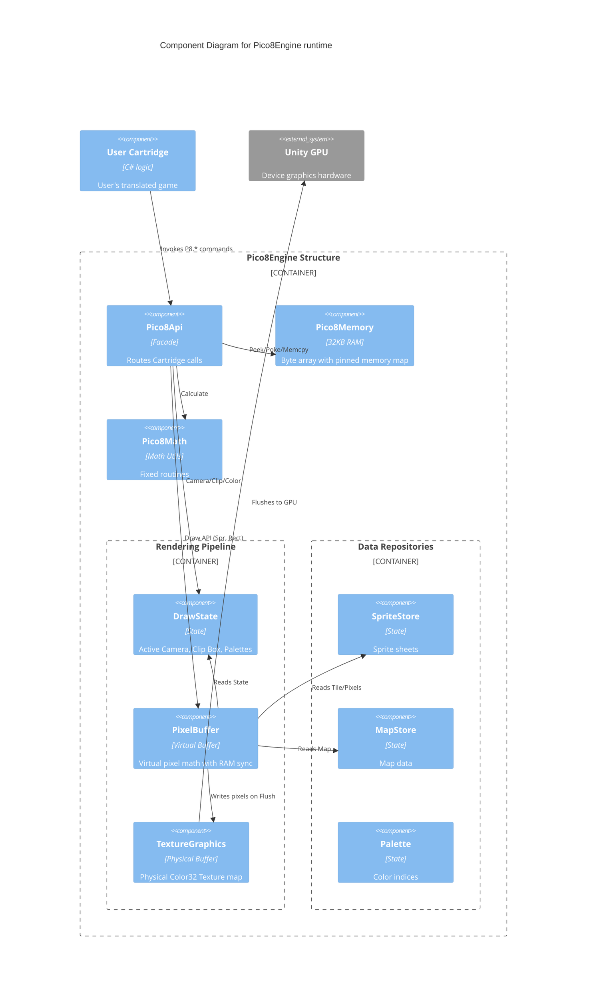

# System Architecture (C4 Model)

This document provides a senior-level architectural overview of the PICO-8 Unity Ecosystem, adopting the **C4 Model** (Context, Containers, Components, and Code). It synthesizes the concepts defined in our [Cartridges](Cartridges.md), [PICO-8 Engine](PICO-8.md), and [Ecosystem Tooling](Ecosystem.md) specifications.

---

## Level 1: System Context 

The System Context illustrates how external users (Players and Developers) interact with the overarching PICO-8 Unity ecosystem.

**Key Responsibilities:**
- **Unity Host Application**: The physical wrapper running on the target device. It captures hardware inputs (gamepads, keyboards) and renders Unity UI.
- **PICO-8 Native Runtime**: The strictly scoped C# engine responsible for emulating PICO-8 behavior without relying on Unity's ECS.
- **Cartridge Dev Tools**: The Editor-only ecosystem that translates raw `.p8` data into functional, compilable Unity packages.

---

## Level 2: Container Diagram

Zooming into the architecture, we separate the system into distinct deployable or logically grouped containers.

**Key Interactions:**
- **`App.cs`**: The ultimate composition root. It wires Unity's implementations of Audio/Input into the framework.
- **`Pico8Builder`**: A fluent factory. It consumes a `Cartridge` and an `EngineSpec`, wiring all internal sub-systems together before returning an immutable `Pico8Engine`.
- **`Pico8View`**: A Unity `VisualElement` (UI Toolkit) that strictly acts as a dumb display. It pushes the `TextureGraphics` output to the player's screen.

---

## Level 3: Component Diagram (The Engine Runtime)

This level breaks open the `Pico8Engine` to visualize the tight internal dependency graph and memory flows that dictate the virtual PICO-8 hardware.

**Component Breakdown:**
1. **The Cartridge (`Cartridge.cs`)**: Contains strictly standard `Init()`, `Update()`, and `Draw()` logic inherited from the `.p8` translation. It holds no engine state itself.
2. **The Facade (`Pico8Api`)**: The gatekeeper. It implements `IPico8` and routes all Cartridge calls (like `P8.Circfill()`, `P8.Btn()`) to the correct internal subsystem. When `Memcpy` touches the screen memory region (`0x6000+`), `Pico8Api` automatically syncs the `PixelBuffer` ↔ RAM (`FlushToRam` → raw copy → `LoadFromRam`).
3. **The Rendering Pipeline**:
    - **`DrawState`**: Pure data structure holding the active Camera, Clip Box, and Palette Mappings for the current frame.
    - **`PixelBuffer`**: Math-heavy module calculating pixel modifications in purely virtual C# `byte[]` arrays. Entirely decoupled from Unity logic. Resolves `EngineSpec.Scale` coordinates. Supports bidirectional sync with `Pico8Memory.Ram` via `FlushToRam()` / `LoadFromRam()` for memory-mapped screen effects (e.g. `Memcpy`-based scrolling).
    - **`TextureGraphics`**: The bridge. On `Flush()`, it maps the `byte[]` through the `Palette` into physical `Color32` arrays, writing directly to Unity's `Texture2D` memory block for extreme flush performance.

---

## Level 4: Code & Data Architecture Details

While UML class diagrams are often overkill, two specific data architectures dictate our ecosystem limitations and expansions:

### 1. The `EngineSpec` Boot Configuration
Instead of hard-coding `128x128`, the system relies entirely on `EngineSpec`. Component allocations (Memory, PixelBuffer, Textures) are entirely dynamic based on the configuration injected during `Pico8Builder.WithSpec()`. 
- **Virtual Resolution**: Game space coordinates.
- **Physical Resolution**: Output texture dimensions.
- **CoordMode**: Evaluates whether an API draw call sits on the virtual grid (upscaled) or the physical grid (1:1 with output).

### 2. The Centralized Tool Store (`CartridgeProgress.json`)
The ecosystem manages all Cartridge package generation data through a singular non-volatile store. 
Instead of polluting individual `package.json` registries, the Editor Tooling (`CartridgeService`) serializes all extraction statuses, migration ports, and doc generations into `CartridgeProgress.json` tracking the ecosystem health natively across branches.
